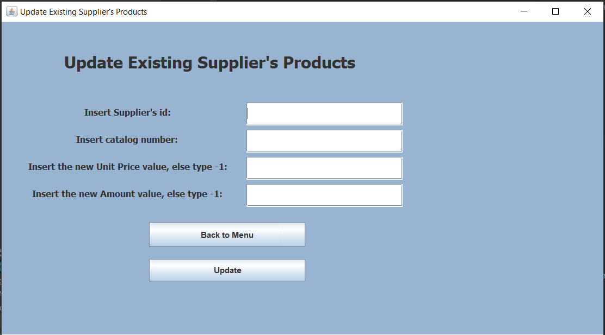

# Supermarket Inventory and Supply Chain Management System

## Overview
This project is a desktop application developed in **Java Swing** to manage the inventory and supply chain of a supermarket. The system consists of a **Presentation Layer**, **Business Layer**, and **Data Access Layer**, designed and developed using **high cohesion and low coupling principles**. The architecture employs **design patterns** such as **Controller**, **DAO**, **Singleton**, and **MVC**, ensuring scalability and maintainability. The GUI is intuitive and designed for efficient user interaction.

  
  
  

## Features
The application provides modules for managing both **inventory** and **suppliers**, with functionalities including:
- Adding, updating, and managing products and suppliers.
- Handling deficiencies reports and generating purchase orders.
- Viewing contracts and supplier history.
- Maintaining inventory records and reports.

## Key Modules

### 1. **Suppliers Module**
The Suppliers module allows users to:
- Add, update, and manage supplier information.
- View and manage supplier contracts.
- Handle deficiencies by automatically finding optimal suppliers based on price and discounts.
- Generate periodic orders for suppliers.
- Manage supplier-product mappings with details like catalog number, price, and stock levels.

#### Data Initialization
On system startup, the Suppliers module initializes by:
- Clearing and reloading all supplier-related tables.
- Pre-loading sample manufacturers, suppliers, supplier products, discounts, and periodic orders.

#### Suppliers Module Functionalities:
1. **Add Supplier:**
   - Enter details like supplier name, domain, contact information, city, bank account, and delivery preferences.
   - Add persistent or occasional suppliers based on business needs.

2. **Update Supplier Products:**
   - Modify product details (e.g., unit price, stock levels) associated with a supplier.

3. **View Supplier Contracts:**
   - See a comprehensive list of contracts, including manufacturers, catalog numbers, and pricing.

4. **Handle Deficiencies:**
   - Generate reports on product shortages and automatically select the best supplier(s) based on price and availability.
   - Optimize supplier selection to minimize costs and reduce the number of suppliers per order.

5. **Add Discounts:**
   - Define supplier-specific discounts (e.g., percentage discounts or free products with bulk purchases).

6. **Periodic Orders:**
   - Manage and update recurring supplier orders for consistent stock replenishment.

### 2. **Inventory Module**
The inventory module includes features for:
- Adding, removing, and updating product information.
- Generating inventory reports (e.g., shortages, expired/damaged products).
- Viewing product price histories and discounts.

### 3. **Main Menu**
The main menu provides options to:
- Access the Suppliers and Inventory modules.
- Add or update suppliers, contracts, and periodic orders.
- Generate and view deficiency reports.

## Technologies and Libraries
- **Java Swing:** For the graphical user interface.
- **javax.swing.table.DefaultTableModel:** Manages table data rendering.
- **java.awt.event.ActionListener:** Handles button clicks and other user actions.
- **java.util.HashMap/ArrayList:** Manages dynamic data structures.

## Usage Instructions
### 1. **System Startup**
- Launch the application to see the main menu.
- Choose between managing inventory or suppliers.

### 2. **Suppliers Module**
- Add new suppliers via the "Add Supplier" option.
- Update supplier-product details by entering catalog numbers and new values.
- View contracts and handle deficiency reports through intuitive table displays.

### 3. **Deficiencies Reports**
- Select the "Handle Deficiencies" option to generate reports.
- Review shortage details and place optimal purchase orders with selected suppliers.

### 4. **Exiting the System**
- Use the "Exit" button to safely close the application.

## Screenshots
### Suppliers Module
1. **Add Supplier Screen:**
   - Enter supplier details and save to the system.
2. **Update Supplier Products:**
   - Modify prices and quantities directly from the GUI.
3. **View Supplier Contracts:**
   - Displays all supplier agreements in a tabular format.
4. **Handle Deficiencies:**
   - Automatically generates purchase orders for deficiencies.

### General System Navigation
- The main menu allows easy access to all functionalities.
- Clear prompts guide users in completing actions efficiently.

## Design Patterns
- **Controller:** Manages user interactions and bridges the GUI with the Business Layer.
- **DAO (Data Access Object):** Encapsulates database operations and provides a clean interface for data access.
- **Singleton:** Ensures a single instance of critical business classes.
- **MVC (Model-View-Controller):** Separates the application logic, user interface, and data management for better maintainability.

## Contributors
- Shir Mordechai
- Ofek Kachlon
- Shay Herling
- Shahar Revivo

